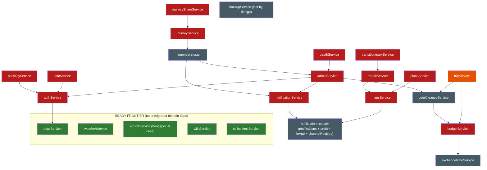

# Legacy `src/services/` dependency graph

Generated from the actual imports in `server/src` on **2026-07-27** (after the
Wave-2 permissions + auditLog pair — step 1 of the dependency-honest order
below, following the dayService fold).
Regenerate any
time — the extraction script only parses `from './x'` /
`from '../services/x'` imports:

```bash
cd server && python3 <scratch>/gen-graph.py   # or re-run the grep-based analysis
```

How to read it:

- **imports (services/)** — what the legacy file pulls from other legacy files. A service is
  *migration-ready* when this column contains only helpers (see classification below) and/or
  `tripAccess` (Wave-2 "don't migrate, delete": absorb into `DatabaseService.canAccessTrip`).
- **imported by (services/)** — legacy files that would need a **bridge or repoint** when this
  one migrates (a legacy module can't inject).
- **nest consumers** — in-container consumers: repoint to the injected service
  (`exports: [XService]` + module import), never a bridge.
- **out-of-container consumers** — `mcp/`, `scheduler.ts`, `websocket.ts`, `db/`,
  `middleware/`, `index.ts`: these are the **bridge pressure** (todo.bridge.ts precedent).

## Node classification

- **Already DI-native (legacy file deleted):** tags, categories, todo, packing, day-notes,
  trip-invite, assignments, share, settings, files, collab, vacay, reservations, day,
  permissions (module-scoped cache retained on purpose — the bridge and DI instances share
  one invalidation), audit (the `writeAudit` injectable; `client-ip.ts` and the deliberately
  side-effectful `audit-log.logger.ts` stay plain modules inside `nest/audit/`).
- **Domain migration targets** (the wave material): adminService, airportService, atlasService,
  authService, backupService, budgetService, collectionsService,
  journeyService, journeyShareService, mapsService, notificationService, oauthService,
  oidcService, passkeyService, placeService, transitService,
  transitItineraryService, tripService, weatherService, wikiService.
- **Cross-cutting Wave-2 targets:** permissions and auditLog are done (2026-07) — see the
  DI-native list above; only tripAccess remains (delete, don't migrate).
- **Helpers that stay as plain modules** (pure/infra, not wave material): avatarUrl,
  queryHelpers, conflictResult, cookie, demo, distanceService, ephemeralTokens, apiKeyCrypto,
  mfaCrypto, passwordPolicy, webauthnConfig, timezoneService, llmConfig, kmlImport, placeImage,
  placePhotoCache, placeEnrichment, unsplashService, exchangeRateService, userCleanupService,
  inAppNotifications, inAppNotificationActions, notificationPreferencesService, notifications
  (+ `notifications/` registry), `memories/` cluster, `airtrail/` cluster. Several of these are
  themselves candidates to fold *into* a domain service when its domain migrates (e.g.
  exchangeRateService → budget, placeEnrichment → places).

## Domain-level graph (edges = "must migrate first, or bridge")



(`placeService → mapsService` is via the `placeEnrichment` helper; `mapsService/notificationService
→ notifications cluster` are hard imports. `memories/` ↔ admin/notificationService edges make the
journey/memories corner tangle with the admin corner. The former
`auth/collections/backup → permissions` and `notifSvc/oauth → auditLog` edges are gone since the
2026-07 Wave-2 pair: the permissions consumers repointed to `nest/permissions/permissions.bridge`,
the writeAudit consumers to `nest/audit/audit.bridge`, and the log*-only consumers to the plain
`nest/audit/audit-log.logger` — none of them block a migration anymore.)

## Full adjacency table

| service | imports (services/) | imported by (services/) | nest consumers | out-of-container consumers |
|---|---|---|---|---|
| `adminService` | apiKeyCrypto, authService, avatarUrl, llmConfig, memories/helpersService, notificationService, passwordPolicy, userCleanupService (+ `permissions.bridge`) | airtrail/airtrailSync, memories/thumbnailService, oauthService | nest/addons/addons.service.ts, nest/admin/admin.service.ts, nest/booking-import/booking-import.service.ts, nest/booking-import/features.controller.ts, nest/collab/collab.mcp.ts, nest/collections/collections-addon.guard.ts, nest/integrations/airtrail-addon.guard.ts, nest/journey/journey.service.ts, nest/llm-parse/llm-config.resolver.ts, nest/oauth/oauth.service.ts, nest/packing/packing.mcp.ts, nest/platform/platform.routes.ts, nest/plugins/host/plugin-host-deps.factory.ts, nest/plugins/journal-entry-rows.controller.ts, nest/plugins/plugin-runtime.service.ts, nest/plugins/plugins.service.ts, nest/todo/todo.mcp.ts, nest/vacay/vacay.mcp.ts | mcp/index.ts, mcp/resources.ts, mcp/tools/atlas.ts, mcp/tools/budget.ts, mcp/tools/journey.ts, mcp/tools/prompts.ts, mcp/tools/trips.ts, scheduler.ts |
| `airportService` | (none) | (none) | nest/airports/airports.service.ts, nest/booking-import/kitinerary-mapper.ts | db/database.ts, mcp/tools/mapsWeather.ts, mcp/tools/transports.ts |
| `apiKeyCrypto` | (none) | adminService, airtrail/airtrailService, authService, llmConfig, mapsService, memories/helpersService, memories/immichService, memories/photoResolverService, memories/synologyService, memories/unifiedService, notifications, oidcService, unsplashService | nest/plugins/plugin-oauth.service.ts, nest/plugins/plugin-runtime.service.ts, nest/plugins/plugins.service.ts, nest/settings/settings.service.ts | db/migrations.ts |
| `atlasService` | (none) | authService | nest/atlas/atlas.service.ts, nest/plugins/host/plugin-host-deps.factory.ts | mcp/resources.ts, mcp/tools/atlas.ts |
| `authService` | apiKeyCrypto, atlasService, avatarUrl, demo, distanceService, ephemeralTokens, mfaCrypto, passwordPolicy, tripMembership, userCleanupService, webauthnConfig (+ `permissions.bridge`) | adminService, oidcService, passkeyService | nest/assignments/assignments.mcp.ts, nest/auth/auth.service.ts, nest/auth/passkey-enabled.guard.ts, nest/collab/collab.mcp.ts, nest/days/day-notes.mcp.ts, nest/days/days.mcp.ts, nest/oidc/oidc.service.ts, nest/packing/packing.mcp.ts, nest/reservations/reservations.mcp.ts, nest/tags/tags.mcp.ts, nest/todo/todo.mcp.ts, nest/vacay/vacay.mcp.ts | mcp/index.ts, mcp/tools/atlas.ts, mcp/tools/budget.ts, mcp/tools/collections.ts, mcp/tools/journey.ts, mcp/tools/notifications.ts, mcp/tools/places.ts, mcp/tools/transit.ts, mcp/tools/transports.ts, mcp/tools/trips.ts |
| `avatarUrl` | (none) | adminService, authService, budgetService, inAppNotifications, journeyService, tripService | nest/collab/collab.service.ts, nest/files/files.service.ts, nest/packing/packing.service.ts, nest/reservations/reservations.service.ts | (none) |
| `backupService` | (none — `permissions.bridge` only) | (none) | nest/backup/backup.controller.ts, nest/backup/backup.service.ts | (none) |
| `budgetService` | avatarUrl, exchangeRateService, tripAccess | tripService, userCleanupService | nest/booking-import/booking-import.service.ts, nest/budget/budget.service.ts, nest/plugins/host/plugin-host-deps.factory.ts, nest/reservations/reservations.mcp.ts, nest/reservations/reservations.service.ts, nest/trips/trips.service.ts | mcp/resources.ts, mcp/tools/budget.ts, mcp/tools/transports.ts, mcp/tools/trips.ts |
| `collectionsService` | placeImage (+ `permissions.bridge`) | (none) | nest/collections/collections.service.ts, nest/plugins/host/plugin-host-deps.factory.ts | mcp/tools/collections.ts |
| `conflictResult` | (none) | placeService | nest/packing/packing.controller.ts, nest/packing/packing.service.ts, nest/places/places.controller.ts, nest/plugins/host/plugin-host-deps.factory.ts | (none) |
| `cookie` | (none) | (none) | nest/auth/auth-public.controller.ts, nest/auth/auth.service.ts, nest/auth/passkey.controller.ts, nest/oidc/oidc.controller.ts, nest/oidc/oidc.service.ts | (none) |
| `demo` | (none) | authService | nest/auth/auth.controller.ts, nest/collections/collections.controller.ts, nest/files/files.controller.ts, nest/places/places.controller.ts, nest/plugins/host/plugin-host-deps.factory.ts, nest/trips/trips.controller.ts | middleware/auth.ts, middleware/mfaPolicy.ts |
| `distanceService` | (none) | authService, transitItineraryService | (none) | (none) |
| `ephemeralTokens` | (none) | authService | nest/files/files.service.ts | index.ts, websocket.ts |
| `exchangeRateService` | (none) | budgetService | nest/budget/budget.service.ts, nest/plugins/host/plugin-host-deps.factory.ts | mcp/tools/budget.ts |
| `inAppNotificationActions` | (none) | inAppNotifications | (none) | (none) |
| `inAppNotifications` | avatarUrl, inAppNotificationActions, notificationPreferencesService | notificationService | nest/notifications/notifications.service.ts | mcp/resources.ts, mcp/tools/notifications.ts |
| `journeyService` | avatarUrl, memories/photoResolverService | journeyShareService | nest/assignments/assignments.service.ts, nest/journey/journey.service.ts, nest/places/places.service.ts, nest/plugins/host/plugin-host-deps.factory.ts, nest/plugins/journal-entry-rows.controller.ts | mcp/resources.ts, mcp/tools/journey.ts, mcp/tools/places.ts |
| `journeyShareService` | journeyService | (none) | nest/journey/journey.service.ts | mcp/tools/journey.ts |
| `kmlImport` | (none) | placeService | (none) | (none) |
| `llmConfig` | apiKeyCrypto | adminService | nest/llm-parse/llm-client.factory.ts, nest/llm-parse/llm-config.resolver.ts | (none) |
| `mapsService` | apiKeyCrypto, notifications, placePhotoCache | placeEnrichment, transitService | nest/booking-import/booking-import.service.ts, nest/maps/maps.service.ts | mcp/tools/mapsWeather.ts, mcp/tools/places.ts |
| `mfaCrypto` | (none) | authService | (none) | (none) |
| `notificationPreferencesService` | notifications, notifications/channelRegistry | inAppNotifications, notificationService, notifications, notifications/channelRegistry | nest/admin/admin.service.ts, nest/notifications/notifications.service.ts, nest/plugins/install/manifest.ts | (none) |
| `notificationService` | inAppNotifications, notificationPreferencesService, notifications, notifications/channelRegistry (+ `audit-log.logger`) | adminService, memories/synologyService, memories/unifiedService | nest/admin/admin.controller.ts, nest/collab/collab.service.ts, nest/packing/packing.service.ts, nest/plugins/host/plugin-host-deps.factory.ts, nest/trips/trips.service.ts | scheduler.ts |
| `notifications` | apiKeyCrypto, notificationPreferencesService (+ `audit-log.logger`) | mapsService, notificationPreferencesService, notificationService, notifications/builtins, oauthService, transitService, webauthnConfig | nest/auth/auth.service.ts, nest/notifications/notifications.service.ts, nest/oauth/oauth.service.ts, nest/oidc/oidc.service.ts, nest/platform/platform.routes.ts, nest/plugins/plugin-oauth.service.ts | index.ts, mcp/index.ts, mcp/oauthProvider.ts |
| `oauthService` | adminService, notifications (+ `audit.bridge`) | (none) | nest/oauth/oauth-api.controller.ts, nest/oauth/oauth.service.ts | mcp/index.ts, mcp/oauthProvider.ts |
| `oidcService` | apiKeyCrypto, authService, tripMembership | (none) | nest/oidc/oidc.service.ts | (none) |
| `passkeyService` | authService, webauthnConfig | (none) | nest/admin/admin.service.ts, nest/auth/passkey.controller.ts | (none) |
| `passwordPolicy` | (none) | adminService, authService | (none) | (none) |
| `placeEnrichment` | mapsService | placeService | (none) | (none) |
| `placeImage` | (none) | collectionsService, placeService | nest/collections/collections.controller.ts, nest/common/place-image-upload.ts, nest/places/places.controller.ts | (none) |
| `placePhotoCache` | (none) | mapsService, placeService | nest/maps/maps.service.ts, nest/share/share.service.ts | scheduler.ts |
| `placeService` | conflictResult, kmlImport, placeEnrichment, placeImage, placePhotoCache, queryHelpers, unsplashService | (none) | nest/booking-import/booking-import.service.ts, nest/days/days.mcp.ts, nest/places/places.service.ts, nest/plugins/host/plugin-host-deps.factory.ts, nest/trips/trips.service.ts | mcp/resources.ts, mcp/tools/places.ts |
| `queryHelpers` | (none) | placeService | nest/assignments/assignments.service.ts, nest/days/days.service.ts, nest/share/share.service.ts | (none) |
| `timezoneService` | (none) | airtrail/airtrailMapper, transitItineraryService, tripService | (none) | (none) |
| `transitItineraryService` | distanceService, timezoneService, transitService (+ type-only `reservations.bridge`) | (none) | (none) | mcp/tools/transit.ts |
| `transitService` | mapsService, notifications | transitItineraryService | nest/transit/transit.controller.ts | mcp/tools/transit.ts |
| `tripAccess` | (none) | budgetService, tripService | nest/booking-import/booking-import.service.ts, nest/collab/collab.service.ts, nest/integrations/airtrail-import.controller.ts, nest/packing/packing.service.ts, nest/reservations/reservations.service.ts, nest/todo/todo.service.ts | (none) |
| `tripMembership` | (none) | authService, oidcService | nest/plugins/host/plugin-host-deps.factory.ts, nest/trip-invite/trip-invite.service.ts | (none) |
| `tripService` | avatarUrl, budgetService, timezoneService, tripAccess, userCleanupService (+ `days.bridge`, `reservations.bridge`) | (none) | nest/feeds/feeds.service.ts, nest/plugins/host/plugin-host-deps.factory.ts, nest/trips/trips.controller.ts, nest/trips/trips.service.ts | mcp/resources.ts, mcp/tools/budget.ts, mcp/tools/prompts.ts, mcp/tools/trips.ts |
| `unsplashService` | apiKeyCrypto | placeService | nest/trips/trips.controller.ts, nest/trips/trips.service.ts | (none) |
| `userCleanupService` | budgetService | adminService, authService, tripService | (none) | (none) |
| `weatherService` | (none) | (none) | nest/plugins/host/plugin-host-deps.factory.ts, nest/weather/weather.controller.ts, nest/weather/weather.service.ts | mcp/tools/mapsWeather.ts |
| `webauthnConfig` | notifications | authService, passkeyService | (none) | (none) |
| `wikiService` | (none) | (none) | nest/help/help.controller.ts | (none) |

## Subdirectory clusters

- **`notifications/`**: `channelRegistry` ⇄ `notificationPreferencesService` (cycle),
  `builtins → notifications + channelRegistry`. Migrates as one unit with
  `notifications.ts`/`notificationService`.
- **`memories/`**: `helpersService` (base) ← immich/synology/unified/photoResolver;
  `photoResolverService` is the seam `journeyService` consumes; `thumbnailService → adminService`
  and `synology/unified → notificationService` couple this cluster to the admin corner.
- **`airtrail/`**: `airtrailClient` (base) ← mapper ← service ← import/sync; `import`/`sync`
  consume `adminService` and (since the 2026-07 reservations fold) the
  `nest/reservations/reservations.bridge` instead of the deleted `reservationService`; since
  the auditLog fold, `airtrailService` writes audits via `nest/audit/audit.bridge` and
  `airtrailSync` logs via the plain `nest/audit/audit-log.logger` (same split in
  `memories/immichService` → bridge).

## Decoding "what's next"

**Ready frontier** (all legacy deps are helpers or `tripAccess`):

| Candidate | Why now / why not | Bridge tax (legacy dependents + out-of-container) |
|---|---|---|
| **exchangeRateService fold → budgetService** ← pick | The Wave-2 pair is done (2026-07); this is step 2 of the dependency-honest order and **is** the tripService unblock | `tripService`, `userCleanupService`; mcp budget/transports/trips registrars |
| **collectionsService** | Newly frontier-ready — its only legacy deps are the placeImage helper + `permissions.bridge` | `mcp/tools/collections.ts` |
| **atlasService** | Zero deps, but its legacy dependent is `authService` (Wave-5) → bridge lives long | `authService`; `mcp/tools/atlas.ts`, `mcp/resources.ts` |
| **weatherService / wikiService / airportService** | Independent leaves; airport has the `db/database.ts` boot lazy-require special case | little / none |

**Blocked, and by what (shortest unblock path):**

- `budgetService` ← `exchangeRateService` (itself zero-dep — one prep hop, or fold it in).
- `tripService` (the hub) ← budget (+ `userCleanupService` → budget; collab,
  vacay, reservations and day are done — their edges are now the
  `collab.bridge` / `vacay.bridge` / `reservations.bridge` / `days.bridge`
  repoints). Migrating budget **is** the tripService unblock.
- `placeService` ← `mapsService` (via placeEnrichment) ← notifications cluster.
- `notificationService` ← notifications cluster (its auditLog edge is now the plain
  `audit-log.logger` import — gone as a blocker since the 2026-07 Wave-2 pair).
- `transitItineraryService` ← `transitService` (← mapsService) — its reservation edge is now
  the `reservations.bridge` repoint (type-only).
- `adminService`/`oauthService`/`authService` corner: `authService` ← `atlasService`
  (its permissions edge is now the `permissions.bridge` repoint); `adminService` ←
  `authService` + `notificationService`; `oauthService` ← `adminService`. Order inside the
  corner: atlas → auth → admin → oauth (oidc/passkey ride auth; permissions done 2026-07).
- `journeyService` ← `memories/` cluster (which itself touches admin + notificationService) →
  `journeyShareService` after.
- `collectionsService`/`backupService`: unblocked since the permissions fold (their edges are
  `permissions.bridge` repoints now); backup still stays last by design (owns the
  closeDb/reinitialize lifecycle).

**Dependency-honest order** (each step's deps are already done at that point;
`vacayService`, `reservationService` (the residue fold), `dayService` and the
Wave-2 `permissions` + `auditLog` pair were the first frontier picks — all done
2026-07, after `collabService` completed Wave 3):

1. `exchangeRateService` fold → `budgetService` (then `userCleanupService` is free)
2. `tripService` — all remaining domain edges + userCleanup now gone
3. notifications cluster → `notificationService`
4. `mapsService` → `transitService` → `placeService` → `transitItineraryService`
5. `atlasService` → `authService` (+ oidc/passkey) → `adminService` → `oauthService`
6. `memories/` cluster → `journeyService` → `journeyShareService`; `collectionsService`
   (frontier-ready since the permissions fold — can also go any time)
7. Independent any time: `weatherService`, `wikiService`, `airportService` (move the
    boot backfill into Nest bootstrap when you do it); `backupService` last

**Corrections to `migrate.md` this graph surfaced:**

- `reservationService` did **not** import `budgetService`/`dayService` — the claimed Wave-4
  ordering constraint didn't exist at the service layer; its legacy remainder was
  frontier-ready. **Borne out by the 2026-07 fold**: the budget/day coupling lives in the
  Nest wrapper's budget-sync seam and the MCP surface, which keep their legacy imports until
  those domains migrate.
- Every remaining Wave-3/4 domain has legacy `tripService` as a dependent — each migration
  before tripService pays a small bridge/repoint tax the files migration didn't have.
