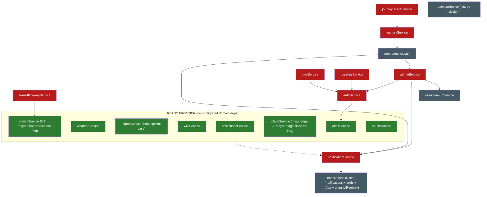

# Legacy `src/services/` dependency graph

Generated from the actual imports in `server/src` on **2026-07-29** (after the
mapsService migration — step 4's head in the dependency-honest order below: the
1429-line geo core folded into the DI-native `MapsService`, its pure helpers
into `nest/maps/maps.helpers.ts`, the 3 geo MCP tools onto the decorator
registry (`maps.mcp.ts` — the weather/airport tools stay in the legacy
`mapsWeather.ts` registrar), BookingImportService injects it, and a 3-export
`maps.bridge.ts` serves `placeEnrichment` + the places registrar; earlier the
same day, the tripService migration + its quirk-fix pass completed step 2: the
1121-line hub folded into the DI-native `TripsService`, its MCP surface moved
to the decorator-driven `trips.mcp.ts`/`share.mcp.ts`, the plugin RPC host
injects it, and the bridge cascade landed — `todo.bridge`, `share.bridge`,
`collab.bridge` and `vacay.bridge` deleted with their last consumers, the
days/budget bridges pruned to their surviving exports. Earlier context: the budgetService
migration (step 1) and the
Phase 0 quick wins: `getAppUrl`/`getMcpSafeUrl` → `src/app-config` deleted the
fake `→ notifications` edges for the identity/MCP stack and freed mapsService;
the addon-enablement reads moved from adminService into `nest/addons/`
(`addons.bridge.ts` for out-of-container consumers), collapsing the admin
god-file's ~27-consumer fan-in to the admin routes + one `admin-2` residual
and freeing oauthService).
This regeneration parses **static `from '...'`, `require('...')` and dynamic
`import('...')`** specifiers, so the lazy edges the earlier grep-based analysis
missed (scheduler jobs, the db-boot airport backfill, the fire-and-forget
notification sends) are now included. Regenerate any time by re-running that
three-pattern import scan over `server/src` (a throwaway script suffices; the
patterns are the whole trick).

How to read it:

- **imports (services/)** — what the legacy file pulls from other legacy files. A service is
  *migration-ready* when this column contains only helpers (see classification below) and/or
  `tripAccess` (Wave-2 "don't migrate, delete": absorb into `DatabaseService.canAccessTrip`).
  Edges tagged **(lazy)** are `import()`/`require()` at call time — they never block a
  migration, because a migrated Nest service can keep the same lazy import until the target
  domain migrates (collab/packing/trips/reservations/vacay all do exactly that for
  `notificationService`).
- **imported by (services/)** — legacy files that would need a **bridge or repoint** when this
  one migrates (a legacy module can't inject).
- **nest consumers** — in-container consumers: repoint to the injected service
  (`exports: [XService]` + module import), never a bridge.
- **out-of-container consumers** — `mcp/`, `scheduler.ts`, `websocket.ts`, `db/`,
  `middleware/`, `systemNotices/`, `index.ts`: these are the **bridge pressure**
  (todo.bridge.ts precedent).

## Node classification

- **Already DI-native (legacy file deleted):** tags, categories, todo, packing, day-notes,
  trip-invite, assignments, share, settings, files, collab, vacay, reservations, day,
  permissions (module-scoped cache retained on purpose — the bridge and DI instances share
  one invalidation), audit (the `writeAudit` injectable; `client-ip.ts` and the deliberately
  side-effectful `audit-log.logger.ts` stay plain modules inside `nest/audit/`),
  exchange-rates (the exchangeRateService fold into `nest/budget/` as the dep-free
  `ExchangeRatesService` — module-scoped rate cache retained on purpose, permissions-style,
  so out-of-container instances and the DI singleton share one cached upstream feed;
  its `exchange-rates.bridge` was deleted with the budgetService migration),
  budget (the 755-line money core folded into `BudgetService`; `budget.bridge.ts` is down
  to the two exports still consumed outside the container — userCleanupService and the
  legacy transports registrar),
  trip (the 1121-line hub folded into `TripsService`; its six bridge imports became
  injected services, and the fold deleted `todo.bridge`, `share.bridge`, `collab.bridge`
  and `vacay.bridge` with their last consumers; a 3-export `trips.bridge.ts` serves the
  legacy prompts registrar's getTripSummary and `budget.mcp.ts`'s getTripOwner/listMembers
  seam — injecting there would need a forwardRef'd TripsModule↔BudgetModule cycle;
  `days.bridge.ts` shrank to getDay/listDays for the transit/transports registrars),
  maps (the 1429-line geo core folded into `MapsService`; pure helpers —
  `buildUserAgent`, the opening-hours parsers, POI categories, Overpass endpoint
  resolution — are plain exports in `nest/maps/maps.helpers.ts` (transitService
  imports its UA from there — helper import, non-blocking); the module-scoped POI
  cache / photo-fetch semaphore / frozen Overpass mirrors stay module-scoped on
  purpose so the bridge instance and the DI singleton share them; a 3-export
  `maps.bridge.ts` (getMapsKey/searchPlaces/getPlacePhoto) serves the legacy
  `placeEnrichment` helper and `mcp/tools/places.ts` until the place domain
  migrates).
- **Domain migration targets** (the wave material): adminService, airportService, atlasService,
  authService, backupService, collectionsService,
  journeyService, journeyShareService, notificationService, oauthService,
  oidcService, passkeyService, placeService, transitService,
  transitItineraryService, weatherService, wikiService.
- **Cross-cutting Wave-2 targets:** permissions and auditLog are done (2026-07) — see the
  DI-native list above; only tripAccess remains (delete, don't migrate).
- **Helpers that stay as plain modules** (pure/infra, not wave material): avatarUrl,
  queryHelpers, conflictResult, cookie, demo, distanceService, ephemeralTokens, apiKeyCrypto,
  mfaCrypto, passwordPolicy, webauthnConfig, timezoneService, llmConfig, kmlImport, placeImage,
  placePhotoCache, placeEnrichment, unsplashService, userCleanupService,
  inAppNotifications, inAppNotificationActions, notificationPreferencesService, notifications
  (+ `notifications/` registry), `memories/` cluster, `airtrail/` cluster. Several of these are
  themselves candidates to fold *into* a domain service when its domain migrates (e.g.
  placeEnrichment → places — the exchangeRateService → budget fold landed 2026-07 on
  exactly this pattern).

## Domain-level graph (edges = "must migrate first, or bridge"; dotted = lazy, non-blocking)

(The former `placeService → mapsService` edge (via the `placeEnrichment` helper) is a
`maps.bridge` repoint since the 2026-07 maps fold, and `transitService`'s UA import is
the pure `maps.helpers` — helpers never block — so both sit on the frontier now;
`notificationService → notifications cluster` is a hard import — the former
`mapsService/transitService/webauthnConfig/
oauthService → notifications` edges were only `getAppUrl`/`getMcpSafeUrl` and died with the
Phase 0 move to `src/app-config`, which had put mapsService on the frontier. `memories/` ↔ admin/notificationService edges make the
journey/memories corner tangle with the admin corner. The former
`auth/collections/backup → permissions` and `notifSvc/oauth → auditLog` edges are gone since the
2026-07 Wave-2 pair: the permissions consumers repointed to `nest/permissions/permissions.bridge`,
the writeAudit consumers to `nest/audit/audit.bridge`, and the log*-only consumers to the plain
`nest/audit/audit-log.logger` — none of them block a migration anymore. The
tripService hub node is gone since the 2026-07 trip fold — the DI-native
`TripsService` injects its former bridge targets and keeps the legacy
avatarUrl/timezoneService/userCleanupService helpers as plain imports (helpers
never block). The dotted
`collections -.-> notifSvc` edge is a call-time `import()` for the collection-invite
notification: it stays as-is through a migration, exactly like the identical lazy sends in the
already-migrated collab/packing/trips/reservations/vacay services.)

## Full adjacency table

| service | imports (services/) | imported by (services/) | nest consumers | out-of-container consumers |
|---|---|---|---|---|
| `adminService` | apiKeyCrypto, authService, avatarUrl, llmConfig, memories/helpersService, notificationService, passwordPolicy, userCleanupService (+ `permissions.bridge`) | (none) | nest/admin/admin.service.ts, nest/packing/packing.mcp.ts (`deletePackingTemplate`, the `admin-2` residual) | scheduler.ts |
| `airportService` | (none) | (none) | nest/airports/airports.service.ts, nest/booking-import/kitinerary-mapper.ts | db/database.ts, mcp/tools/mapsWeather.ts, mcp/tools/transports.ts |
| `apiKeyCrypto` | (none) | adminService, airtrail/airtrailService, authService, llmConfig, memories/helpersService, memories/immichService, memories/photoResolverService, memories/synologyService, memories/unifiedService, notifications, oidcService, unsplashService | nest/maps/maps.service.ts, nest/plugins/plugin-oauth.service.ts, nest/plugins/plugin-runtime.service.ts, nest/plugins/plugins.service.ts, nest/settings/settings.service.ts | db/migrations.ts |
| `atlasService` | (none) | authService | nest/atlas/atlas.service.ts, nest/plugins/host/plugin-host-deps.factory.ts | mcp/resources.ts, mcp/tools/atlas.ts |
| `authService` | apiKeyCrypto, atlasService, avatarUrl, demo, distanceService, ephemeralTokens, mfaCrypto, passwordPolicy, tripMembership, userCleanupService, webauthnConfig (+ `permissions.bridge`) | adminService, oidcService, passkeyService | nest/assignments/assignments.mcp.ts, nest/auth/auth.service.ts, nest/auth/passkey-enabled.guard.ts, nest/budget/budget.mcp.ts, nest/collab/collab.mcp.ts, nest/days/day-notes.mcp.ts, nest/days/days.mcp.ts, nest/oidc/oidc.service.ts, nest/packing/packing.mcp.ts, nest/reservations/reservations.mcp.ts, nest/share/share.mcp.ts, nest/tags/tags.mcp.ts, nest/todo/todo.mcp.ts, nest/trips/trips.mcp.ts, nest/vacay/vacay.mcp.ts | mcp/index.ts, mcp/tools/atlas.ts, mcp/tools/collections.ts, mcp/tools/journey.ts, mcp/tools/notifications.ts, mcp/tools/places.ts, mcp/tools/transit.ts, mcp/tools/transports.ts |
| `avatarUrl` | (none) | adminService, authService, inAppNotifications, journeyService | nest/budget/budget.service.ts, nest/collab/collab.service.ts, nest/files/files.service.ts, nest/packing/packing.service.ts, nest/reservations/reservations.service.ts, nest/trips/trips.service.ts | (none) |
| `backupService` | (none — `permissions.bridge`, plugin backup/paths infra only) | (none) | nest/backup/backup.controller.ts, nest/backup/backup.service.ts | (none) |
| `collectionsService` | notificationService (lazy), placeImage (+ `permissions.bridge`) | (none) | nest/collections/collections.service.ts, nest/plugins/host/plugin-host-deps.factory.ts | mcp/tools/collections.ts |
| `conflictResult` | (none) | placeService | nest/packing/packing.controller.ts, nest/packing/packing.service.ts, nest/places/places.controller.ts, nest/plugins/host/plugin-host-deps.factory.ts | (none) |
| `cookie` | (none) | (none) | nest/auth/auth-public.controller.ts, nest/auth/auth.service.ts, nest/auth/passkey.controller.ts, nest/oidc/oidc.controller.ts, nest/oidc/oidc.service.ts | (none) |
| `demo` | (none) | authService | nest/auth/auth.controller.ts, nest/collections/collections.controller.ts, nest/files/files.controller.ts, nest/places/places.controller.ts, nest/plugins/host/plugin-host-deps.factory.ts, nest/trips/trips.controller.ts | middleware/auth.ts, middleware/mfaPolicy.ts |
| `distanceService` | (none) | authService, transitItineraryService | (none) | (none) |
| `ephemeralTokens` | (none) | authService | nest/files/files.service.ts | index.ts, websocket.ts |
| `inAppNotificationActions` | (none) | inAppNotifications | (none) | (none) |
| `inAppNotifications` | avatarUrl, inAppNotificationActions, notificationPreferencesService | notificationService | nest/notifications/notifications.service.ts | mcp/resources.ts, mcp/tools/notifications.ts |
| `journeyService` | avatarUrl, memories/photoResolverService | journeyShareService | nest/assignments/assignments.service.ts, nest/journey/journey.service.ts, nest/places/places.service.ts, nest/plugins/host/plugin-host-deps.factory.ts, nest/plugins/journal-entry-rows.controller.ts | mcp/resources.ts, mcp/tools/journey.ts, mcp/tools/places.ts |
| `journeyShareService` | journeyService | (none) | nest/journey/journey.service.ts | mcp/tools/journey.ts |
| `kmlImport` | (none) | placeService | (none) | (none) |
| `llmConfig` | apiKeyCrypto | adminService | nest/llm-parse/llm-client.factory.ts, nest/llm-parse/llm-config.resolver.ts | (none) |
| `mfaCrypto` | (none) | authService | (none) | (none) |
| `notificationPreferencesService` | notifications, notifications/builtins, notifications/channelRegistry | inAppNotifications, notificationService, notifications, notifications/channelRegistry | nest/admin/admin.service.ts, nest/notifications/notifications.service.ts, nest/plugins/install/manifest.ts | (none) |
| `notifications` | apiKeyCrypto, notificationPreferencesService (+ `audit-log.logger`) | notificationPreferencesService, notificationService, notifications/builtins | nest/auth/auth.service.ts, nest/notifications/notifications.service.ts | (none) |
| `notificationService` | inAppNotifications, notificationPreferencesService, notifications, notifications/channelRegistry (+ `audit-log.logger`) | adminService, collectionsService, memories/synologyService, memories/unifiedService | nest/admin/admin.controller.ts, nest/collab/collab.service.ts, nest/packing/packing.service.ts, nest/plugins/host/plugin-host-deps.factory.ts, nest/reservations/reservations.service.ts, nest/trips/trips.service.ts, nest/vacay/vacay.service.ts | scheduler.ts |
| `oauthService` | (none — `addons.bridge` + `audit.bridge` only) | (none) | nest/oauth/oauth-api.controller.ts, nest/oauth/oauth.service.ts | mcp/index.ts, mcp/oauthProvider.ts |
| `oidcService` | apiKeyCrypto, authService, tripMembership | (none) | nest/oidc/oidc.service.ts | (none) |
| `passkeyService` | authService, webauthnConfig | (none) | nest/admin/admin.service.ts, nest/auth/passkey.controller.ts | (none) |
| `passwordPolicy` | (none) | adminService, authService | (none) | (none) |
| `placeEnrichment` | (none — `maps.bridge` since the maps fold) | placeService | (none) | (none) |
| `placeImage` | (none) | collectionsService, placeService | nest/collections/collections.controller.ts, nest/common/place-image-upload.ts, nest/places/places.controller.ts | (none) |
| `placePhotoCache` | (none) | placeService | nest/maps/maps.service.ts, nest/share/share.service.ts | scheduler.ts |
| `placeService` | conflictResult, kmlImport, placeEnrichment, placeImage, placePhotoCache, queryHelpers, unsplashService | (none) | nest/booking-import/booking-import.service.ts, nest/days/days.mcp.ts, nest/places/places.service.ts, nest/plugins/host/plugin-host-deps.factory.ts, nest/trips/trips.service.ts | mcp/resources.ts, mcp/tools/places.ts |
| `queryHelpers` | (none) | placeService | nest/assignments/assignments.service.ts, nest/days/days.service.ts, nest/share/share.service.ts | (none) |
| `timezoneService` | (none) | airtrail/airtrailMapper, transitItineraryService | nest/trips/trips.service.ts | (none) |
| `transitItineraryService` | distanceService, timezoneService, transitService (+ type-only `reservations.bridge`) | (none) | (none) | mcp/tools/transit.ts |
| `transitService` | (none — `buildUserAgent` is the pure `nest/maps/maps.helpers`) | transitItineraryService | nest/transit/transit.controller.ts | mcp/tools/transit.ts |
| `tripAccess` | (none) | (none) | nest/booking-import/booking-import.service.ts, nest/budget/budget.service.ts, nest/collab/collab.service.ts, nest/days/day-notes.service.ts, nest/integrations/airtrail-import.controller.ts, nest/packing/packing.service.ts, nest/reservations/reservations.service.ts, nest/todo/todo.service.ts | (none) |
| `tripMembership` | (none) | authService, oidcService | nest/plugins/host/plugin-host-deps.factory.ts, nest/trip-invite/trip-invite.service.ts | (none) |
| `unsplashService` | apiKeyCrypto | placeService | nest/trips/trips.controller.ts, nest/trips/trips.service.ts | (none) |
| `userCleanupService` | (none — `budget.bridge`, plugin paths infra only) | adminService, authService | nest/trips/trips.service.ts | (none) |
| `weatherService` | (none) | (none) | nest/plugins/host/plugin-host-deps.factory.ts, nest/weather/weather.controller.ts, nest/weather/weather.service.ts | mcp/tools/mapsWeather.ts |
| `webauthnConfig` | (none) | authService, passkeyService | (none) | (none) |
| `wikiService` | (none) | (none) | nest/help/help.controller.ts | (none) |

## Subdirectory clusters

- **`notifications/`**: `channelRegistry` ⇄ `notificationPreferencesService` (cycle),
  `builtins → notifications + channelRegistry`, and `notificationPreferencesService →
  builtins` (registering the built-in channels closes a second loop). Migrates as one unit
  with `notifications.ts`/`notificationService`.
- **`memories/`**: `helpersService` (base) ← immich/synology/unified/photoResolver;
  `photoResolverService` is the seam `journeyService` consumes (it also pulls
  immich/synology/thumbnail/`trekPhotoCache` — the latter is swept by `scheduler.ts`);
  `synology/unified → notificationService` couples this
  cluster to the admin corner (`thumbnailService`'s adminService edge was only
  `isAddonEnabled` — now `addons.bridge`); `immichService` writes audits via `nest/audit/audit.bridge`.
- **`airtrail/`**: `airtrailClient` (base) ← mapper ← service ← import/sync; `import`/`sync`
  consume (since the 2026-07 reservations fold) the
  `nest/reservations/reservations.bridge` instead of the deleted `reservationService`
  (their adminService edge was only `isAddonEnabled` — now `addons.bridge`); since
  the auditLog fold, `airtrailService` writes audits via `nest/audit/audit.bridge` and
  `airtrailSync` logs via the plain `nest/audit/audit-log.logger` (same split in
  `memories/immichService` → bridge).

## Decoding "what's next"

**Ready frontier** (all legacy deps are helpers, `tripAccess`, or lazy sends):

| Candidate | Why now / why not | Bridge tax (legacy dependents + out-of-container) |
|---|---|---|
| **transitService** ← pick | Frontier-ready since the maps fold (its only maps import is the pure `maps.helpers` UA); next in the step-4 chain, unblocks transitItineraryService | `transitItineraryService`; `mcp/tools/transit.ts` |
| **placeService** | Frontier-ready since the maps fold (the `placeEnrichment` edge is a `maps.bridge` repoint); its legacy imports are all helpers — the fold can absorb `placeEnrichment` (exchange-rates precedent) and retire `maps.bridge` with it | `mcp/resources.ts`, `mcp/tools/places.ts` |
| **collectionsService** | Frontier-ready — legacy deps are the placeImage helper + `permissions.bridge`, plus a call-time lazy `import()` of notificationService that a migrated service keeps (collab precedent) | `mcp/tools/collections.ts` |
| **atlasService** | Zero deps, but its legacy dependent is `authService` (Wave-5) → bridge lives long | `authService`; `mcp/tools/atlas.ts`, `mcp/resources.ts` |
| **oauthService** | Dependency-free since the Phase 0 addons extraction (adminService edge was only `isAddonEnabled` → `addons.bridge`) — but the coherence order keeps it after admin so the `mcp/oauthProvider.ts` merge (`mcp-2`) lands with it | `mcp/index.ts`, `mcp/oauthProvider.ts` |
| **weatherService / wikiService / airportService** | Independent leaves; airport has the `db/database.ts` boot lazy-require special case | little / none |

**Blocked, and by what (shortest unblock path):**

- `notificationService` ← notifications cluster (its auditLog edge is now the plain
  `audit-log.logger` import — gone as a blocker since the 2026-07 Wave-2 pair).
- `transitItineraryService` ← `transitService` (frontier-ready since the maps fold) —
  its reservation edge is now the `reservations.bridge` repoint (type-only).
- `adminService`/`authService` corner: `authService` ← `atlasService`
  (its permissions edge is now the `permissions.bridge` repoint); `adminService` ←
  `authService` + `notificationService`. `oauthService` is dependency-free since the
  Phase 0 addons extraction (its adminService edge was only `isAddonEnabled`, now
  `addons.bridge`), but the coherence order stays atlas → auth → admin → oauth so the
  `mcp/oauthProvider.ts` merge (`mcp-2`) lands after admin (oidc/passkey ride auth;
  permissions done 2026-07).
- `journeyService` ← `memories/` cluster (which itself touches admin + notificationService) →
  `journeyShareService` after.
- `collectionsService`/`backupService`: unblocked since the permissions fold (their edges are
  `permissions.bridge` repoints now; collections' notificationService edge is lazy — see
  above); backup still stays last by design (owns the closeDb/reinitialize lifecycle and the
  plugin backup/paths infra).

**Dependency-honest order** (each step's deps are already done at that point;
`vacayService`, `reservationService` (the residue fold), `dayService` and the
Wave-2 `permissions` + `auditLog` pair were the first frontier picks — all done
2026-07, after `collabService` completed Wave 3):

1. `exchangeRateService` fold → `budgetService` (both done 2026-07 — `ExchangeRatesService`
   then the full `BudgetService` fold in `nest/budget/`; `userCleanupService` is free,
   repointed to `budget.bridge`)
2. `tripService` (done 2026-07 — the hub folded into `TripsService`; the trips/share MCP
   surfaces moved to the decorator registry, the plugin host injects it, and the
   todo/share/collab/vacay bridges died with their last consumers)
3. notifications cluster → `notificationService`
4. `mapsService` (done 2026-07 — the geo core folded into `MapsService`, geo MCP
   tools onto the decorator registry, BookingImportService injects it, and the
   3-export `maps.bridge` covers placeEnrichment + the places registrar)
   → `transitService` → `placeService` → `transitItineraryService`
5. `atlasService` → `authService` (+ oidc/passkey) → `adminService` → `oauthService`
6. `memories/` cluster → `journeyService` → `journeyShareService`; `collectionsService`
   (frontier-ready since the permissions fold — can also go any time)
7. Independent any time: `weatherService`, `wikiService`, `airportService` (move the
    boot backfill into Nest bootstrap when you do it); `backupService` last

**Corrections to `migrate.md` this graph surfaced:**

- `reservationService` did **not** import `budgetService`/`dayService` — the claimed Wave-4
  ordering constraint didn't exist at the service layer; its legacy remainder was
  frontier-ready. **Borne out by the 2026-07 fold**: the budget/day coupling lives in the
  Nest wrapper's budget-sync seam and the MCP surface, which keep their legacy imports until
  those domains migrate.
- Every remaining Wave-3/4 domain had legacy `tripService` as a dependent — each migration
  before tripService paid a small bridge/repoint tax the files migration didn't have.
  **Resolved by the 2026-07 trip fold**: that recurring tax is gone, and the fold cashed in
  the accumulated bridges (todo/share/collab/vacay deleted, days/budget pruned).
- (2026-07-28 regeneration) The earlier grep-based analysis only saw static imports, so it
  missed every lazy edge: the scheduler's `require()` jobs (admin, notificationService,
  placePhotoCache, airtrailSync, trekPhotoCache), the `db/database.ts` boot backfill's
  airportService require, `index.ts` → ephemeralTokens, `systemNotices/conditions.ts` →
  adminService, and `collectionsService`'s call-time `import()` of notificationService. It
  also under-reported `tripService`'s bridge repoints (six, not three: budget, collab, days,
  packing, reservations, vacay). None of this changes the order — lazy edges don't block —
  but the bridge-pressure column was undercounting scheduler/system-notice consumers.
- (2026-07-29 regeneration, post trip fold) The predicted bridge tax was right in shape but
  the fold went further than a bridge: the whole trips MCP surface (10 tools + 3 resources
  + the first `@Prompt`) and the 3 share-link tools moved onto the decorator registry, so
  the only bridge left is the 3-export `trips.bridge.ts` for the legacy prompts registrar
  and `budget.mcp.ts`'s owner/member seam. `verifyTripAccess`'s `tripAccess` re-export died
  with the legacy file, leaving `services/tripAccess` with zero legacy importers — it is
  now purely Nest-consumed (Wave-2 "delete, don't migrate" is down to those repoints).
- (2026-07-29 regeneration, post maps fold) The predicted bridge tax over-counted:
  `transitService` needed no bridge at all — its only import was the pure `buildUserAgent`,
  which now lives in `maps.helpers.ts` as a plain export (helpers never block), and after
  the geo tools moved onto the decorator registry `mcp/tools/mapsWeather.ts` no longer
  consumes the maps domain (the registrar file survives for its weather + airport tools;
  its `searchPlaces` import turned out to be dead code and died with the prune). The
  bridge is 3 exports for `placeEnrichment` + `mcp/tools/places.ts`, both of which the
  placeService migration will absorb. Step 4's remaining chain — transitService →
  placeService — is now entirely frontier-ready.
