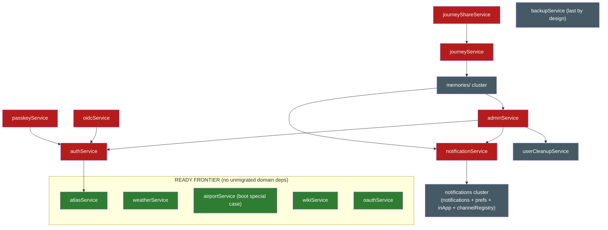

# Legacy `src/services/` dependency graph

Generated from the actual imports in `server/src` on **2026-08-01** (after the
collectionsService fold — the biggest single fold yet, taken off the ready
frontier while the notifications fan-in stays the order's official next step:
the 1024-line saved-places core (visibility/roles, the collection-scoped
dedup, saved-places CRUD, copy-to-trip with the ratings filters, labels, the
fusion invitation state machine) folded into the DI-native `CollectionsService`
over `DatabaseService` + `PermissionsService` + `RealtimeService` — the
`permissions.bridge` and websocket `broadcastToUser` imports became injections,
the `placeImage` helper import stays plain, the `sendInvite` call-time
`import()` of notificationService stays lazily as-is (collab precedent), and
`deleteOldCollectionCover` re-anchored its `__dirname` path one directory
deeper. The whole 25-tool `mcp/tools/collections.ts` registrar moved onto the
decorator registry as `collections.mcp.ts` — deliberately with **no `when:`
addon gate**, because the legacy registrar registered unconditionally while
REST (`CollectionsAddonGuard`) and the plugin host (`requireAddon`) gate on the
addon; that asymmetry is now pinned as a characterization case. The plugin RPC
host swapped its 7 collections imports for the injected `CollectionsService`
(its 22nd constructor dep), so the domain needed **no bridge at all** — the
fifth consecutive zero-bridge fold. The legacy registrar had no tool-level
tests; a new 23-case `tools-collections` suite now covers payloads, error
texts, scope gating and the addon-gate absence, and the moved 47-case
`COLLECTIONS-SVC-*` suite gained two membership-lookup cases. A sibling DTO
ratchet cleared both collections body-contract allow-list entries (`reorder`,
`delete-many`), retiring the last two hand-rolled 400 strings of the domain in
favour of the pipe envelope (places precedent). A day earlier, the
transitItineraryService relocation closed step 4 — the fourth and final link
of that chain, and the first pure-helpers relocation with no
service fold at all: the 287-line module is 100% pure — no SQL, no DB, no
broadcasts — so its Zod itinerary schemas + endpoint/metadata builders moved
byte-identical to `nest/transit/transit-itinerary.helpers.ts` (the schemas must
stay module-level plain exports: `transit.mcp.ts` consumes them inside
`@Tool({ inputSchema })` decorators, which evaluate at module load before any
container exists), its sole consumer — the in-container `transit.mcp.ts` — was
a one-import repoint, and a new 21-case `TRANSIT-ITIN-*` characterization suite
pins the previously untested superRefine error strings, `??` time fallbacks,
coordinate tolerances and builder output. The
notifications fan-in heads the frontier. Before that, the placeService
migration (2026-07-30): the 1029-line place core (CRUD + ratings SQL,
the GPX/KML/KMZ importers, the Google/Naver list importers) folded into the
DI-native `PlacesService`; the pure pieces — the frozen XML parsers, the KMZ
unpacker, the dedup predicates, the Google hex-id parsers, `reclaimPhotoCache`
— into `nest/places/places.helpers.ts` (maps.helpers precedent); the whole
10-tool `mcp/tools/places.ts` registrar **plus** the
`trek://trips/{tripId}/places` resource onto the decorator registry
(`places.mcp.ts`, with `search_place` coming along because its gate is
`places:read` and now injecting `MapsService`); TripsService, DaysMcp,
BookingImportService and the plugin RPC host (its 21st constructor dep) all
inject `PlacesService`, so the domain needs **no bridge at all**. The sibling
`placeEnrichment` fold went further: that helper's DB/websocket/Maps half became
`PlacesService` methods over the injected
`DatabaseService`/`RealtimeService`/`MapsService` and its pure match selector
joined `places.helpers.ts` — which retired **`maps.bridge.ts`** with its last
consumer. A DTO ratchet commit cleared all seven `PlacesController` body
allow-list entries, and a trailing `fix(server)` commit repaired four verified
defects the relocation had faithfully carried (see "Quirks fixed" below).
Earlier the same week, the transitService migration opened the tail of step 4
(the 333-line Transitous/MOTIS proxy into the dep-free `TransitService`, pure
stats/types into `nest/transit/transit.helpers.ts`, the 3-tool registrar onto
the decorator registry — zero bridge files, registrar deleted); before that the
mapsService fold (the 1429-line geo core into `MapsService`, pure helpers into
`maps.helpers.ts`, the 3 geo MCP tools onto the registry), and before that the
tripService fold completing step 2 (the 1121-line hub into `TripsService`, its
MCP surface onto `trips.mcp.ts`/`share.mcp.ts`, the plugin host injecting it,
and the bridge cascade — `todo.bridge`, `share.bridge`, `collab.bridge` and
`vacay.bridge` deleted with their last consumers, days/budget pruned to their
survivors). Earlier context: the budgetService migration (step 1) and the
Phase 0 quick wins: `getAppUrl`/`getMcpSafeUrl` → `src/app-config` deleted the
fake `→ notifications` edges for the identity/MCP stack and freed mapsService;
the addon-enablement reads moved from adminService into `nest/addons/`
(`addons.bridge.ts` for out-of-container consumers), collapsing the admin
god-file's ~27-consumer fan-in to the admin routes + one `admin-2` residual
and freeing oauthService.
This regeneration parses **static `from '...'`, `require('...')` and dynamic
`import('...')`** specifiers, so the lazy edges the earlier grep-based analysis
missed (scheduler jobs, the db-boot airport backfill, the fire-and-forget
notification sends) are included. Regenerate any time by re-running that
three-pattern import scan over `server/src` (a throwaway script suffices; the
patterns are the whole trick).

How to read it:

- **imports (services/)** — what the legacy file pulls from other legacy files. A service is
  *migration-ready* when this column contains only helpers (see classification below) and/or
  `tripAccess` (Wave-2 "don't migrate, delete": absorb into `DatabaseService.canAccessTrip`).
  Edges tagged **(lazy)** are `import()`/`require()` at call time — they never block a
  migration, because a migrated Nest service can keep the same lazy import until the target
  domain migrates (collab/packing/trips/reservations/vacay all do exactly that for
  `notificationService`).
- **imported by (services/)** — legacy files that would need a **bridge or repoint** when this
  one migrates (a legacy module can't inject).
- **nest consumers** — in-container consumers: repoint to the injected service
  (`exports: [XService]` + module import), never a bridge.
- **out-of-container consumers** — `mcp/`, `scheduler.ts`, `websocket.ts`, `db/`,
  `middleware/`, `systemNotices/`, `index.ts`: these are the **bridge pressure**
  (todo.bridge.ts precedent).

## Node classification

- **Already DI-native (legacy file deleted):** tags, categories, todo, packing, day-notes,
  trip-invite, assignments, share, settings, files, collab, vacay, reservations, day,
  permissions (module-scoped cache retained on purpose — the bridge and DI instances share
  one invalidation), audit (the `writeAudit` injectable; `client-ip.ts` and the deliberately
  side-effectful `audit-log.logger.ts` stay plain modules inside `nest/audit/`),
  exchange-rates (the exchangeRateService fold into `nest/budget/` as the dep-free
  `ExchangeRatesService` — module-scoped rate cache retained on purpose, permissions-style,
  so out-of-container instances and the DI singleton share one cached upstream feed;
  its `exchange-rates.bridge` was deleted with the budgetService migration),
  budget (the 755-line money core folded into `BudgetService`; `budget.bridge.ts` is down
  to the two exports still consumed outside the container — userCleanupService and the
  legacy transports registrar),
  trip (the 1121-line hub folded into `TripsService`; its six bridge imports became
  injected services, and the fold deleted `todo.bridge`, `share.bridge`, `collab.bridge`
  and `vacay.bridge` with their last consumers; a 3-export `trips.bridge.ts` serves the
  legacy prompts registrar's getTripSummary and `budget.mcp.ts`'s getTripOwner/listMembers
  seam — injecting there would need a forwardRef'd TripsModule↔BudgetModule cycle;
  `days.bridge.ts` shrank to getDay/listDays — since the transit fold, for the
  transports registrar alone),
  maps (the 1429-line geo core folded into `MapsService`; pure helpers —
  `buildUserAgent`, the opening-hours parsers, POI categories, Overpass endpoint
  resolution — are plain exports in `nest/maps/maps.helpers.ts` (the DI-native
  TransitService imports its UA from there); the module-scoped POI
  cache / photo-fetch semaphore / frozen Overpass mirrors stay module-scoped on
  purpose so any out-of-container instance and the DI singleton share them;
  **`maps.bridge.ts` is gone** — the place fold absorbed both of its consumers,
  the `placeEnrichment` helper and the places MCP registrar, and PlacesService /
  PlacesMcp / BookingImportService now inject `MapsService` directly),
  transit (the first fully SQL-free domain fold: the Transitous/MOTIS proxy
  became the dep-free `TransitService` — response cache, frozen-at-import
  `TRANSIT_API_BASE` and lazy User-Agent memo stay module-scoped on purpose;
  the pure `deriveTransitStats` + `SCHEDULED_TRANSIT_MODES` + itinerary types
  are plain exports in `nest/transit/transit.helpers.ts` (maps.helpers
  precedent), consumed since the 2026-08 relocation by the colocated
  `transit-itinerary.helpers.ts`; the 3-tool
  registrar moved to `transit.mcp.ts` and was deleted — no bridge ever
  existed for this domain),
  transit-itinerary (the pure-helpers relocation closing step 4: schemas +
  endpoint/metadata builders moved byte-identical from the legacy
  `transitItineraryService` to `nest/transit/transit-itinerary.helpers.ts` —
  plain exports, no service, no bridge, no DTO, no plugin-host work; the
  `distanceService`/`timezoneService` helper imports stay plain, the
  `EndpointInput` type import repointed from `reservations.bridge` to
  `reservations.service` directly),
  place (the 1029-line place core folded into `PlacesService`, its pure half into
  `nest/places/places.helpers.ts`, and the whole MCP surface — 10 tools + the
  trip-places resource — onto `places.mcp.ts`; the `placeEnrichment` helper was
  absorbed in the same wave, taking `maps.bridge.ts` with it. **Zero bridge
  files**: every consumer is in-container. The two `assignments.bridge` imports
  that `places.mcp.ts` keeps are a deliberate cycle break —
  AssignmentsModule imports DaysModule and DaysModule imports PlacesModule for
  `days.mcp.ts`'s place creation, so injecting AssignmentsService there would
  close DaysModule → PlacesModule → AssignmentsModule → DaysModule; the same
  seam `reservations.mcp.ts` uses and the same trade `trips.bridge.ts`
  documents),
  collections (the 1024-line saved-places core folded into `CollectionsService`
  over `DatabaseService`/`PermissionsService`/`RealtimeService`; the 25-tool
  registrar moved to `collections.mcp.ts` **without** a `when:` addon gate —
  the legacy registrar's addon-gate asymmetry, preserved and test-pinned; the
  plugin host injects the service as its 22nd constructor dep; the `sendInvite`
  lazy notificationService `import()` stays call-time (collab precedent); the
  dead `buildDedupSet` module helper was dropped in the move — the only
  non-verbatim line. **Zero bridge files**: every consumer is in-container).
- **Domain migration targets** (the wave material): adminService, airportService, atlasService,
  authService, backupService,
  journeyService, journeyShareService, notificationService, oauthService,
  oidcService, passkeyService, weatherService, wikiService.
- **Cross-cutting Wave-2 targets:** permissions and auditLog are done (2026-07) — see the
  DI-native list above; only tripAccess remains (delete, don't migrate).
- **Helpers that stay as plain modules** (pure/infra, not wave material): avatarUrl,
  queryHelpers, conflictResult, cookie, demo, distanceService, ephemeralTokens, apiKeyCrypto,
  mfaCrypto, passwordPolicy, webauthnConfig, timezoneService, llmConfig, kmlImport, placeImage,
  placePhotoCache, unsplashService, userCleanupService,
  inAppNotifications, inAppNotificationActions, notificationPreferencesService, notifications
  (+ `notifications/` registry), `memories/` cluster, `airtrail/` cluster. Several of these are
  themselves candidates to fold *into* a domain service when its domain migrates — and two
  already have: exchangeRateService → budget (2026-07) and **placeEnrichment → place**
  (2026-07), the latter also retiring a bridge. The four still reached only from
  `nest/places/*` (kmlImport, placeImage, placePhotoCache, unsplashService) are the
  next obvious fold candidates, but none of them blocks anything.

## Domain-level graph (edges = "must migrate first, or bridge"; dotted = lazy, non-blocking)

(The `collectionsService` node is gone since the 2026-08-01 fold — its dotted
call-time `import()` edge to notificationService survives inside the DI-native
`CollectionsService`, exactly like the identical lazy sends in the
already-migrated collab/packing/trips/reservations/vacay services, so it never
appears here again; its `permissions.bridge` repoint became an injected
`PermissionsService` and its `placeImage` import stays a plain helper import.
The `transitItineraryService` node is gone since the 2026-08-01 relocation —
its `transitService` edge had already become the pure
`nest/transit/transit.helpers` import when the transit domain went DI-native,
and the relocation moved the whole module into `nest/transit/` as
`transit-itinerary.helpers.ts`, so nothing was left to bridge or repoint beyond
the one `transit.mcp.ts` import. The `placeService` node is gone since the
2026-07-30 fold — its legacy imports were
all helpers, and the former `placeService → mapsService` edge (via `placeEnrichment`)
died with the helper rather than becoming a repoint.
`notificationService → notifications cluster` is a hard import — the former
`mapsService/transitService/webauthnConfig/
oauthService → notifications` edges were only `getAppUrl`/`getMcpSafeUrl` and died with the
Phase 0 move to `src/app-config`, which had put mapsService on the frontier. `memories/` ↔ admin/notificationService edges make the
journey/memories corner tangle with the admin corner. The former
`auth/collections/backup → permissions` and `notifSvc/oauth → auditLog` edges are gone since the
2026-07 Wave-2 pair: the permissions consumers repointed to `nest/permissions/permissions.bridge`,
the writeAudit consumers to `nest/audit/audit.bridge`, and the log*-only consumers to the plain
`nest/audit/audit-log.logger` — none of them block a migration anymore. The
tripService hub node is gone since the 2026-07 trip fold — the DI-native
`TripsService` injects its former bridge targets and keeps the legacy
avatarUrl/timezoneService/userCleanupService helpers as plain imports (helpers
never block).)

## Full adjacency table

| service | imports (services/) | imported by (services/) | nest consumers | out-of-container consumers |
|---|---|---|---|---|
| `adminService` | apiKeyCrypto, authService, avatarUrl, llmConfig, memories/helpersService, notificationService, passwordPolicy, userCleanupService (+ `permissions.bridge`, `addons.bridge`) | (none) | nest/admin/admin.service.ts, nest/packing/packing.mcp.ts (`deletePackingTemplate`, the `admin-2` residual) | scheduler.ts (lazy) |
| `airportService` | (none) | (none) | nest/airports/airports.service.ts, nest/booking-import/kitinerary-mapper.ts | db/database.ts (lazy boot backfill), mcp/tools/mapsWeather.ts, mcp/tools/transports.ts |
| `apiKeyCrypto` | (none) | adminService, airtrail/airtrailService, authService, llmConfig, memories/helpersService, memories/immichService, memories/photoResolverService, memories/synologyService, memories/unifiedService, notifications, oidcService, unsplashService | nest/maps/maps.service.ts, nest/plugins/plugin-oauth.service.ts, nest/plugins/plugin-runtime.service.ts, nest/plugins/plugins.service.ts, nest/settings/settings.service.ts | db/migrations.ts |
| `atlasService` | (none) | authService | nest/atlas/atlas.service.ts, nest/plugins/host/plugin-host-deps.factory.ts | mcp/resources.ts, mcp/tools/atlas.ts |
| `authService` | apiKeyCrypto, atlasService, avatarUrl, demo, distanceService, ephemeralTokens, mfaCrypto, passwordPolicy, tripMembership, userCleanupService, webauthnConfig (+ `permissions.bridge`) | adminService, oidcService, passkeyService | nest/assignments/assignments.mcp.ts, nest/auth/auth.service.ts, nest/auth/passkey-enabled.guard.ts, nest/budget/budget.mcp.ts, nest/collab/collab.mcp.ts, nest/collections/collections.mcp.ts, nest/days/day-notes.mcp.ts, nest/days/days.mcp.ts, nest/oidc/oidc.service.ts, nest/packing/packing.mcp.ts, nest/places/places.mcp.ts, nest/reservations/reservations.mcp.ts, nest/share/share.mcp.ts, nest/tags/tags.mcp.ts, nest/todo/todo.mcp.ts, nest/transit/transit.mcp.ts, nest/trips/trips.mcp.ts, nest/vacay/vacay.mcp.ts | mcp/index.ts, mcp/tools/atlas.ts, mcp/tools/journey.ts, mcp/tools/notifications.ts, mcp/tools/transports.ts |
| `avatarUrl` | (none) | adminService, authService, inAppNotifications, journeyService | nest/budget/budget.service.ts, nest/collab/collab.service.ts, nest/files/files.service.ts, nest/packing/packing.service.ts, nest/reservations/reservations.service.ts, nest/trips/trips.service.ts | (none) |
| `backupService` | (none — `permissions.bridge`, plugin backup/paths infra only) | (none) | nest/backup/backup.controller.ts, nest/backup/backup.service.ts | scheduler.ts (lazy) |
| `conflictResult` | (none) | (none) | nest/packing/packing.controller.ts, nest/packing/packing.service.ts, nest/places/places.controller.ts, nest/places/places.service.ts, nest/plugins/host/plugin-host-deps.factory.ts | (none) |
| `cookie` | (none) | (none) | nest/auth/auth-public.controller.ts, nest/auth/auth.service.ts, nest/auth/passkey.controller.ts, nest/oidc/oidc.controller.ts, nest/oidc/oidc.service.ts | (none) |
| `demo` | (none) | authService | nest/auth/auth.controller.ts, nest/collections/collections.controller.ts, nest/files/files.controller.ts, nest/places/places.controller.ts, nest/plugins/host/plugin-host-deps.factory.ts, nest/trips/trips.controller.ts | middleware/auth.ts, middleware/mfaPolicy.ts |
| `distanceService` | (none) | authService | nest/transit/transit-itinerary.helpers.ts | (none) |
| `ephemeralTokens` | (none) | authService | nest/files/files.service.ts | index.ts, websocket.ts |
| `inAppNotificationActions` | (none) | inAppNotifications | (none) | (none) |
| `inAppNotifications` | avatarUrl, inAppNotificationActions, notificationPreferencesService | notificationService | nest/notifications/notifications.service.ts | mcp/resources.ts, mcp/tools/notifications.ts |
| `journeyService` | avatarUrl, memories/photoResolverService | journeyShareService | nest/assignments/assignments.service.ts, nest/journey/journey.service.ts, nest/places/places.mcp.ts, nest/places/places.service.ts, nest/plugins/host/plugin-host-deps.factory.ts, nest/plugins/journal-entry-rows.controller.ts | mcp/resources.ts, mcp/tools/journey.ts |
| `journeyShareService` | journeyService | (none) | nest/journey/journey.service.ts | mcp/tools/journey.ts |
| `kmlImport` | (none) | (none) | nest/places/places.helpers.ts, nest/places/places.service.ts | (none) |
| `llmConfig` | apiKeyCrypto | adminService | nest/llm-parse/llm-client.factory.ts, nest/llm-parse/llm-config.resolver.ts | (none) |
| `mfaCrypto` | (none) | authService | (none) | (none) |
| `notificationPreferencesService` | notifications, notifications/builtins, notifications/channelRegistry | inAppNotifications, notificationService, notifications, notifications/channelRegistry | nest/admin/admin.service.ts, nest/notifications/notifications.service.ts, nest/plugins/install/manifest.ts | (none) |
| `notifications` | apiKeyCrypto, notificationPreferencesService (+ `audit-log.logger`) | notificationPreferencesService, notificationService, notifications/builtins | nest/auth/auth.service.ts, nest/notifications/notifications.service.ts | (none) |
| `notificationService` | inAppNotifications, notificationPreferencesService, notifications, notifications/channelRegistry (+ `audit-log.logger`) | adminService, memories/synologyService, memories/unifiedService | nest/admin/admin.controller.ts, nest/collab/collab.service.ts, nest/collections/collections.service.ts (lazy), nest/packing/packing.service.ts, nest/plugins/host/plugin-host-deps.factory.ts, nest/reservations/reservations.service.ts, nest/trips/trips.service.ts, nest/vacay/vacay.service.ts | scheduler.ts (lazy) |
| `oauthService` | (none — `addons.bridge` + `audit.bridge` only) | (none) | nest/oauth/oauth-api.controller.ts, nest/oauth/oauth.service.ts | mcp/index.ts, mcp/oauthProvider.ts |
| `oidcService` | apiKeyCrypto, authService, tripMembership | (none) | nest/oidc/oidc.service.ts | (none) |
| `passkeyService` | authService, webauthnConfig | (none) | nest/admin/admin.service.ts, nest/auth/passkey.controller.ts | (none) |
| `passwordPolicy` | (none) | adminService, authService | (none) | (none) |
| `placeImage` | (none) | (none) | nest/collections/collections.controller.ts, nest/collections/collections.service.ts, nest/common/place-image-upload.ts, nest/places/places.controller.ts, nest/places/places.service.ts | (none) |
| `placePhotoCache` | (none) | (none) | nest/maps/maps.service.ts, nest/places/places.helpers.ts, nest/share/share.service.ts | scheduler.ts (lazy) |
| `queryHelpers` | (none) | (none) | nest/assignments/assignments.service.ts, nest/days/days.service.ts, nest/places/places.service.ts, nest/share/share.service.ts | (none) |
| `timezoneService` | (none) | airtrail/airtrailMapper | nest/transit/transit-itinerary.helpers.ts, nest/trips/trips.service.ts | (none) |
| `tripAccess` | (none) | (none) | nest/booking-import/booking-import.service.ts, nest/budget/budget.service.ts, nest/collab/collab.service.ts, nest/days/day-notes.service.ts, nest/integrations/airtrail-import.controller.ts, nest/packing/packing.service.ts, nest/reservations/reservations.service.ts, nest/todo/todo.service.ts | (none) |
| `tripMembership` | (none) | authService, oidcService | nest/plugins/host/plugin-host-deps.factory.ts, nest/trip-invite/trip-invite.service.ts | (none) |
| `unsplashService` | apiKeyCrypto | (none) | nest/places/places.service.ts, nest/trips/trips.controller.ts, nest/trips/trips.service.ts | (none) |
| `userCleanupService` | (none — `budget.bridge`, plugin paths infra only) | adminService, authService | nest/trips/trips.service.ts | (none) |
| `weatherService` | (none) | (none) | nest/plugins/host/plugin-host-deps.factory.ts, nest/weather/weather.controller.ts, nest/weather/weather.service.ts | mcp/tools/mapsWeather.ts |
| `webauthnConfig` | (none) | authService, passkeyService | (none) | (none) |
| `wikiService` | (none) | (none) | nest/help/help.controller.ts | (none) |

## Subdirectory clusters

- **`notifications/`**: `channelRegistry` ⇄ `notificationPreferencesService` (cycle),
  `builtins → notifications + channelRegistry`, and `notificationPreferencesService →
  builtins` (registering the built-in channels closes a second loop). Migrates as one unit
  with `notifications.ts`/`notificationService`.
- **`memories/`**: `helpersService` (base) ← immich/synology/unified/photoResolver;
  `photoResolverService` is the seam `journeyService` consumes (it also pulls
  immich/synology/thumbnail/`trekPhotoCache` — the latter is swept by `scheduler.ts`);
  `synology/unified → notificationService` couples this
  cluster to the admin corner (`thumbnailService`'s adminService edge was only
  `isAddonEnabled` — now `addons.bridge`); `immichService` writes audits via `nest/audit/audit.bridge`.
- **`airtrail/`**: `airtrailClient` (base) ← mapper ← service ← import/sync; `import`/`sync`
  consume (since the 2026-07 reservations fold) the
  `nest/reservations/reservations.bridge` instead of the deleted `reservationService`
  (their adminService edge was only `isAddonEnabled` — now `addons.bridge`); since
  the auditLog fold, `airtrailService` writes audits via `nest/audit/audit.bridge` and
  `airtrailSync` logs via the plain `nest/audit/audit-log.logger` (same split in
  `memories/immichService` → bridge).

## Decoding "what's next"

**Ready frontier** (all legacy deps are helpers, `tripAccess`, or lazy sends):

With step 4 closed by the 2026-08 transit-itinerary relocation, the pick is no
longer on this table: the dependency-honest order's next step is the
**notifications cluster → `notificationService`** fan-in (step 3, deferred
while step 4 ran) — it must precede its admin/memories dependents. The
frontier candidates below can still go any time:

| Candidate | Why now / why not | Bridge tax (legacy dependents + out-of-container) |
|---|---|---|
| **atlasService** | Zero deps, but its legacy dependent is `authService` (Wave-5) → bridge lives long | `authService`; `mcp/tools/atlas.ts`, `mcp/resources.ts` |
| **oauthService** | Dependency-free since the Phase 0 addons extraction (adminService edge was only `isAddonEnabled` → `addons.bridge`) — but the coherence order keeps it after admin so the `mcp/oauthProvider.ts` merge (`mcp-2`) lands with it | `mcp/index.ts`, `mcp/oauthProvider.ts` |
| **weatherService / wikiService / airportService** | Independent leaves; airport has the `db/database.ts` boot lazy-require special case | little / none |

**Blocked, and by what (shortest unblock path):**

- `notificationService` ← notifications cluster (its auditLog edge is now the plain
  `audit-log.logger` import — gone as a blocker since the 2026-07 Wave-2 pair).
- `adminService`/`authService` corner: `authService` ← `atlasService`
  (its permissions edge is now the `permissions.bridge` repoint); `adminService` ←
  `authService` + `notificationService`. `oauthService` is dependency-free since the
  Phase 0 addons extraction (its adminService edge was only `isAddonEnabled`, now
  `addons.bridge`), but the coherence order stays atlas → auth → admin → oauth so the
  `mcp/oauthProvider.ts` merge (`mcp-2`) lands after admin (oidc/passkey ride auth;
  permissions done 2026-07).
- `journeyService` ← `memories/` cluster (which itself touches admin + notificationService) →
  `journeyShareService` after. Note the place fold added two more in-container
  journeyService consumers (`places.service.ts`'s hooks and `places.mcp.ts`'s
  skeleton reconcile), so this migration's repoint list grew by two.
- `backupService`: unblocked since the permissions fold (its edge is a
  `permissions.bridge` repoint now) but stays last by design (owns the
  closeDb/reinitialize lifecycle and the plugin backup/paths infra).
  `collectionsService` cashed in the same unblock on 2026-08-01 — done.

**Dependency-honest order** (each step's deps are already done at that point;
`vacayService`, `reservationService` (the residue fold), `dayService` and the
Wave-2 `permissions` + `auditLog` pair were the first frontier picks — all done
2026-07, after `collabService` completed Wave 3):

1. `exchangeRateService` fold → `budgetService` (both done 2026-07 — `ExchangeRatesService`
   then the full `BudgetService` fold in `nest/budget/`; `userCleanupService` is free,
   repointed to `budget.bridge`)
2. `tripService` (done 2026-07 — the hub folded into `TripsService`; the trips/share MCP
   surfaces moved to the decorator registry, the plugin host injects it, and the
   todo/share/collab/vacay bridges died with their last consumers)
3. notifications cluster → `notificationService`
4. `mapsService` (done 2026-07 — the geo core folded into `MapsService`, geo MCP
   tools onto the decorator registry, BookingImportService injects it, and a
   3-export `maps.bridge` covered placeEnrichment + the places registrar)
   → `transitService` (done 2026-07 — the SQL-free proxy folded into the dep-free
   `TransitService`, pure stats/types to `transit.helpers.ts`, the whole 3-tool
   registrar to `transit.mcp.ts`; no bridge)
   → `placeService` (done 2026-07 — the place core folded into `PlacesService`,
   the pure half to `places.helpers.ts`, the 10-tool registrar + trip-places
   resource to `places.mcp.ts`; TripsService/DaysMcp/BookingImportService/the
   plugin host inject it, so **no bridge**; the sibling `placeEnrichment` fold
   deleted `maps.bridge` with its last consumer, and the DTO ratchet cleared all
   seven `PlacesController` allow-list entries)
   → `transitItineraryService` (done 2026-08 — the last link: the 100%-pure
   module relocated byte-identical to `nest/transit/transit-itinerary.helpers.ts`
   as plain exports, `transit.mcp.ts` repointed, no service/bridge/DTO work, a
   new 21-case `TRANSIT-ITIN-*` characterization suite — **step 4 complete**)
5. `atlasService` → `authService` (+ oidc/passkey) → `adminService` → `oauthService`
6. `memories/` cluster → `journeyService` → `journeyShareService`; `collectionsService`
   (done 2026-08-01 — taken off the frontier ahead of step 3: the 1024-line fold
   into `CollectionsService`, the 25-tool registrar onto `collections.mcp.ts`,
   the plugin host injecting it as its 22nd constructor dep, no bridge, and the
   DTO ratchet clearing both allow-list entries)
7. Independent any time: `weatherService`, `wikiService`, `airportService` (move the
    boot backfill into Nest bootstrap when you do it); `backupService` last

**Corrections to `migrate.md` this graph surfaced:**

- `reservationService` did **not** import `budgetService`/`dayService` — the claimed Wave-4
  ordering constraint didn't exist at the service layer; its legacy remainder was
  frontier-ready. **Borne out by the 2026-07 fold**: the budget/day coupling lives in the
  Nest wrapper's budget-sync seam and the MCP surface, which keep their legacy imports until
  those domains migrate.
- Every remaining Wave-3/4 domain had legacy `tripService` as a dependent — each migration
  before tripService paid a small bridge/repoint tax the files migration didn't have.
  **Resolved by the 2026-07 trip fold**: that recurring tax is gone, and the fold cashed in
  the accumulated bridges (todo/share/collab/vacay deleted, days/budget pruned).
- (2026-07-28 regeneration) The earlier grep-based analysis only saw static imports, so it
  missed every lazy edge: the scheduler's `require()` jobs (admin, notificationService,
  placePhotoCache, airtrailSync, trekPhotoCache), the `db/database.ts` boot backfill's
  airportService require, `index.ts` → ephemeralTokens, `systemNotices/conditions.ts` →
  adminService, and `collectionsService`'s call-time `import()` of notificationService. It
  also under-reported `tripService`'s bridge repoints (six, not three: budget, collab, days,
  packing, reservations, vacay). None of this changes the order — lazy edges don't block —
  but the bridge-pressure column was undercounting scheduler/system-notice consumers.
- (2026-07-29 regeneration, post trip fold) The predicted bridge tax was right in shape but
  the fold went further than a bridge: the whole trips MCP surface (10 tools + 3 resources
  + the first `@Prompt`) and the 3 share-link tools moved onto the decorator registry, so
  the only bridge left is the 3-export `trips.bridge.ts` for the legacy prompts registrar
  and `budget.mcp.ts`'s owner/member seam. `verifyTripAccess`'s `tripAccess` re-export died
  with the legacy file, leaving `services/tripAccess` with zero legacy importers — it is
  now purely Nest-consumed (Wave-2 "delete, don't migrate" is down to those repoints).
- (2026-07-29 regeneration, post maps fold) The predicted bridge tax over-counted:
  `transitService` needed no bridge at all — its only import was the pure `buildUserAgent`,
  which now lives in `maps.helpers.ts` as a plain export (helpers never block), and after
  the geo tools moved onto the decorator registry `mcp/tools/mapsWeather.ts` no longer
  consumes the maps domain (the registrar file survives for its weather + airport tools;
  its `searchPlaces` import turned out to be dead code and died with the prune). The
  bridge is 3 exports for `placeEnrichment` + `mcp/tools/places.ts`, both of which the
  placeService migration will absorb. Step 4's remaining chain — transitService →
  placeService — is now entirely frontier-ready.
- (2026-07-29 regeneration, post transit fold) The "no bridge at all" prediction held —
  and the fold went further than predicted in the other direction: the whole 3-tool
  registrar moved onto the decorator registry, **including `create_transit_journey`**,
  which never imported transitService — its days/reservations bridge imports became
  injected `DaysService`/`ReservationsService` and its raw `canAccessTrip` the injected
  `DatabaseService`. `mcp/tools/transit.ts` was deleted outright (no mapsWeather-style
  survivor), `days.bridge.ts` is down to its last consumer (the transports registrar),
  and `reservations.bridge.ts` lost two of its remaining out-of-container call sites.
  The `transitItineraryService → transitService` edge became the pure
  `transit.helpers` import, and its only remaining consumer is the **in-container**
  `transit.mcp.ts` — so transitItineraryService joined the frontier with a bridge tax
  of zero, ahead of the order's placeService step.
- (2026-07-30 regeneration, post place fold) The prediction that placeService "will absorb"
  both `maps.bridge` consumers held exactly: `placeEnrichment` folded into `PlacesService`
  and the places registrar became `places.mcp.ts` injecting `MapsService`, so
  **`maps.bridge.ts` was deleted** and the place domain needed no bridge of its own — the
  fourth consecutive fold to end with zero new bridge files. Two things the earlier analysis
  did not predict: (a) `search_place` travelled with the *places* registrar rather than
  joining `maps.mcp.ts`, because its gate is `places:read` and not the read-only `geo`
  group — the same gate-follows-the-tool rule that sent the share-link tools to
  `share.mcp.ts` during the trip fold; and (b) the fold **created** a module cycle risk
  the recipe had not hit before — DaysModule must import PlacesModule for
  `days.mcp.ts`'s place creation, while AssignmentsModule already imports DaysModule, so
  `places.mcp.ts` keeps its two `assignments.bridge` imports rather than injecting
  AssignmentsService. That leaves `assignments.bridge.ts` with **only in-container
  consumers** (places.mcp.ts + reservations.mcp.ts) — a bridge kept purely as a cycle
  break, which is a new category the classification above should track. The four helpers
  now reached only from `nest/places/*` (kmlImport, placeImage, placePhotoCache,
  unsplashService) are the residue this fold could have absorbed and did not; none of them
  blocks anything, so they stay as plain modules for now.
- (2026-08-01 regeneration, post transit-itinerary relocation) The "bridge tax zero" and
  "the fold is a repoint" predictions held exactly — and the shape went one step further
  than the frontier row implied: there was no fold at all. The module turned out to be
  100% pure (no SQL, no DB access, no broadcasts), so every recipe step except the move
  itself was a no-op, and a hard constraint settled the target shape: the Zod schemas are
  consumed inside `transit.mcp.ts`'s `@Tool({ inputSchema })` decorators, which evaluate
  at module load — before any container exists — so they must stay module-level plain
  exports (maps.helpers precedent), not members of an injectable. The type-only
  `reservations.bridge` import repointed to `reservations.service` directly (the bridge
  only re-exports `EndpointInput`), so the relocation removed one of
  `reservations.bridge.ts`'s remaining import sites without touching its runtime exports.
  One risk the graph had not tracked: the legacy module had **no direct test suite** — its
  12 superRefine error strings and the endpoint/metadata builder were pinned only through
  the 9 MCP transit tool cases — so the relocation added a 21-case `TRANSIT-ITIN-*`
  characterization suite (the file now sits inside the ≥80% `src/nest/**` coverage gate).
  Still open, now tracked here: the client's `TransitSearchPanel.tsx` hand-duplicates the
  `endpoints`/`metadata.transit` build with observable divergences from
  `buildTransitReservationParts` (the scheduled-time fallback one is a real defect, fixed
  in the trailing commits below); the durable cure is lifting the contract to
  `shared/src/`, which remains follow-up work, not part of the relocation.
- (2026-08-01 regeneration, post collections fold) The frontier row's predictions held
  almost exactly: the legacy deps really were just `placeImage` + `permissions.bridge` +
  the lazy notificationService send, and the "bridge tax: `mcp/tools/collections.ts`"
  claim resolved to **zero bridges** because the whole 25-tool registrar moved onto the
  decorator registry rather than being repointed — the fifth consecutive zero-bridge fold,
  which by now looks like the rule rather than the exception (the graph's "bridge tax"
  column consistently over-predicts: a registrar is a *port*, not a repoint). The row's
  suggestion that the fold could share the dedup helpers with `places.helpers.ts` was NOT
  taken — the collection-scoped ports differ in table and semantics (name-first dedup with
  coords as fallback, vs. places' variants), so they stayed private to the service; only
  the never-called `buildDedupSet` module helper was dropped. Two things the graph had not
  tracked: (a) like transit-itinerary before it, the domain's MCP surface had **no tests
  at all** — the 25 tools were pinned only through the service suite — so the fold added a
  23-case `tools-collections` characterization suite; and (b) the legacy registrar
  registered **without an addon gate** while REST and the plugin host both gate on the
  collections addon — a real behavioral asymmetry that a naive "add `when:` like todo"
  port would have silently fixed; parity kept it and the new suite pins it (a quirk-fix
  candidate for a trailing commit, not part of the relocation).

## Quirks fixed after the place fold (the trailing `fix(server)` commit)

The relocation itself was byte-identical; these four defects were then fixed on top, each
with a failing-first regression test, so the parity diff and the behaviour change stayed in
separate commits:

1. **Coordinates of exactly 0 were dropped.** `createPlace` ran every optional field through
   `x || null`, so a place on the equator or the prime meridian lost its `lat`/`lng`. Now
   `?? null` for lat/lng/price and `?? 60` for duration_minutes.
2. **`duration_minutes: 0` was unsettable.** On create the falsy coercion replaced it with
   the 60-minute default; on update `duration_minutes || null` fed `COALESCE(?, …)`, which
   read the 0 as "absent" and silently kept the old value.
3. **The journey delete hook fired on unscoped ids.** `onPlaceDeleted` keys on the place id
   alone, so `DELETE /:id`, `POST /bulk-delete` and the `delete_place` MCP tool could detach
   *another* trip's journey entries for an id they then refused. All three now scope first
   (via the new `PlacesService.scopedIds`, mirroring the guard `PluginHostDepsFactory`
   already had), and `bulk_delete_places` also moved its hook ahead of the DELETE —
   `journey_entries.source_place_id` is ON DELETE SET NULL, so running it afterwards left
   the entries as orphans instead of removing them.
4. **The place search treated `%` and `_` as wildcards.** A bare `%` in the search box
   returned the whole trip. The three LIKE clauses now carry `ESCAPE '\'` with the term
   escaped by `escapeLikePattern`.

Plus one hardening item on the same commit: the Google list-import response is now capped at
8 MB (declared `content-length` and post-read length, the `transit.service` precedent) and
its `JSON.parse` is guarded, so a malformed provider payload produces the existing
`'Invalid list data received from Google Maps'` 400 instead of throwing.

**Quirks deliberately preserved** (parity, not oversights): the non-COALESCE `route_color`
(an explicit null is how the picker resets a track to its category colour, #776);
`currency`/`transport_mode` still unclearable through `x || null` + COALESCE, since no client
action expresses "clear this string" and dropping COALESCE would change the absent-means-
unchanged contract; `importGpx` returning `null` (→ a 400) when a file parses but yields no
usable geometry; `update` skipping the If-Match check entirely when the stored `updated_at`
is null (old rows keep last-write-wins); and every remaining string-valued `x || null`, where
empty-string-means-absent is the intended reading.
